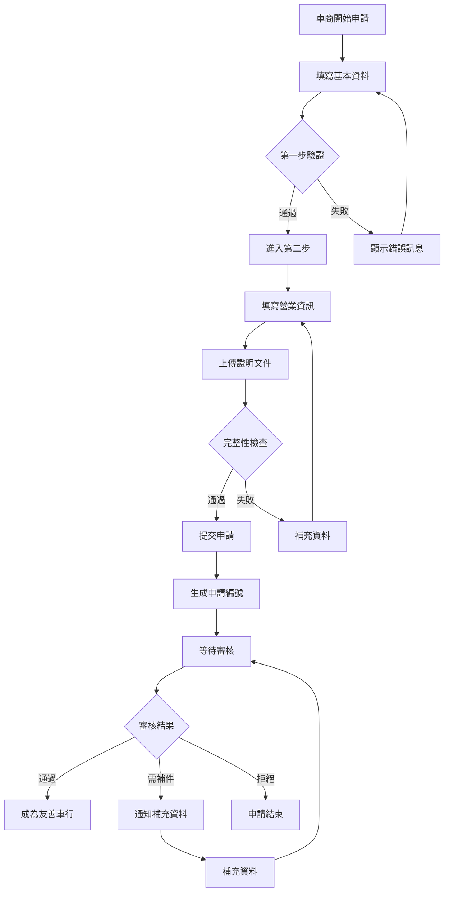
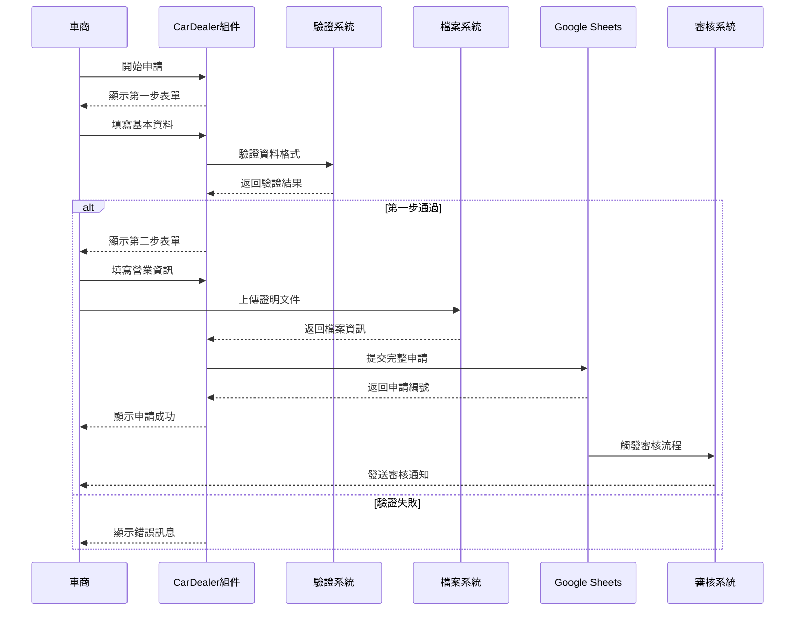

# CarDealer 車商申請模組

## 📋 功能概述
車商申請模組提供車行業者申請成為友善車行的完整流程，包含多步驟申請表單、資格審核、以及後續的業務合作管理。

## 🎯 主要功能
- **多步驟申請**：分階段的車商申請流程
- **資格審核**：車商資格和條件驗證
- **業務資料管理**：車行基本資訊和營業資料
- **合作條件設定**：服務項目和合作模式選擇
- **申請進度追蹤**：即時查看申請狀態
- **文件上傳**：支援相關證明文件上傳

## 🏗️ 架構設計

### 組件結構
```
CarDealer/
├── index.jsx          # 主要車商申請組件
├── RiderStep.jsx      # 申請步驟組件
└── README.md         # 本文件
```

### 技術棧
- **React Hook Form**：多步驟表單管理
- **Ant Design**：企業級 UI 組件
- **狀態管理**：本地狀態和表單狀態
- **文件處理**：檔案上傳和驗證
- **資料驗證**：商業資料格式驗證

## 🔧 核心實現

### 主要功能模組

1. **多步驟表單管理**
   ```javascript
   const [currentStep, setCurrentStep] = useState(1);
   const [formData, setFormData] = useState({});
   
   const handleNext = (values) => {
     setFormData(prev => ({ ...prev, ...values }));
     setCurrentStep(2);
   };
   ```

2. **申請流程控制**
   - Step 1: 基本資料填寫
   - Step 2: 詳細資訊和文件上傳
   - 資料暫存和恢復機制

3. **表單驗證系統**
   - 營業登記證驗證
   - 聯絡資訊格式檢查
   - 服務項目完整性驗證

### 申請步驟設計
- **第一步**：車行基本資訊
  - 車行名稱和地址
  - 負責人資訊
  - 聯絡方式
  
- **第二步**：營業資訊
  - 營業項目和服務
  - 合作條件設定
  - 相關證明文件

## 📊 申請流程圖



## 🔄 資料流程



## 🎨 UI/UX 設計

### 企業級設計原則
- **專業外觀**：符合商業使用的介面設計
- **流程清晰**：明確的步驟指示和進度顯示
- **資料安全**：敏感資訊的保護和加密
- **效率優先**：減少不必要的操作步驟

### 表單設計特色
- **分步驟填寫**：避免單一頁面資訊過載
- **即時驗證**：輸入時立即檢查格式
- **資料暫存**：防止意外關閉造成資料遺失
- **檔案預覽**：上傳文件的預覽功能

## 🔧 核心功能實現

### 表單狀態管理
```javascript
const handleNext = (values) => {
  setFormData(prev => ({
    ...prev,
    ...values
  }));
  setCurrentStep(2);
};

const handleSubmit = async (values) => {
  const finalData = {
    ...formData,
    ...values
  };
  // 提交邏輯
};
```

### 檔案上傳處理
- 支援多種檔案格式
- 檔案大小限制
- 上傳進度顯示
- 錯誤處理機制

## 🔗 相關組件
- `RiderStep` - 申請步驟指示組件
- `Form` - Ant Design 表單組件
- `Upload` - 檔案上傳組件
- `Steps` - 步驟進度組件

## 📋 申請資料結構
```javascript
{
  // 第一步：基本資料
  shopName: "車行名稱",
  address: "營業地址",
  contactPerson: "負責人姓名",
  phone: "聯絡電話",
  email: "電子郵件",
  
  // 第二步：營業資訊
  businessLicense: "營業登記證號",
  services: ["銷售", "維修", "保養"],
  cooperationMode: "合作模式",
  documents: [/* 上傳的檔案 */]
}
```

## 📱 響應式支援
- **桌面版**：完整的表單功能和檔案管理
- **平板版**：適應觸控操作的表單設計
- **手機版**：簡化的步驟流程和大按鈕設計

## 🔧 業務邏輯
- **資格審核標準**：營業登記、服務能力評估
- **合作條件**：服務項目、地理位置、營業時間
- **後續管理**：定期評核、服務品質監控

## 🎯 目標用戶
- **車行業者**：機車銷售和維修業者
- **經銷商**：品牌授權經銷商
- **服務商**：相關服務提供者

## 🔧 環境變數
- 申請資料存儲設定
- 檔案上傳服務設定
- 審核流程 API 設定
