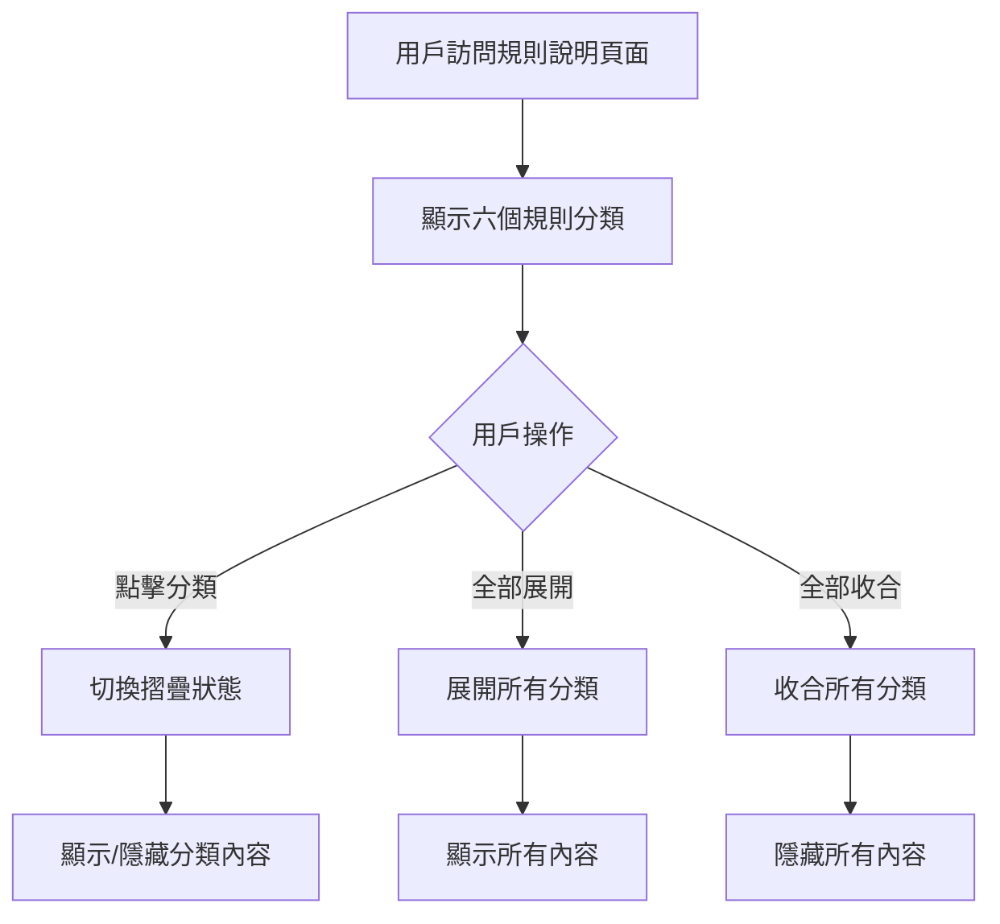

# Description 規則說明模組

## 📋 功能概述
規則說明模組提供基隆市電動機車補助計畫的詳細規則說明，使用可摺疊的區塊展示不同類別的規則內容。

## 🎯 主要功能
- **分類規則展示**：按類別組織的規則說明內容
- **摺疊/展開功能**：可摺疊的內容區塊
- **全部展開/收合**：一鍵控制所有區塊
- **圖示化展示**：使用圖示增強視覺效果

## 🏗️ 架構設計

### 組件結構
```
Description/
├── index.jsx          # 主要規則說明組件
└── README.md         # 本文件
```

### 技術實現
- **React**：基礎框架
- **Ant Design**：UI 組件庫 (Row, Col, PlusOutlined, MinusOutlined)
- **狀態管理**：使用 useState 管理摺疊狀態

## 🔧 核心實現

### 主要組件
```javascript
function Description() {
  const [activeKeys, setActiveKeys] = useState({
    time: false,
    method: false,
    items: false,
    qualification: false,
    payment: false,
    service: false,
  });

  const handleToggle = (key) => {
    setActiveKeys((prev) => ({
      ...prev,
      [key]: !prev[key],
    }));
  };

  const handleCollapseAll = () => {
    setActiveKeys({
      time: false,
      method: false,
      items: false,
      qualification: false,
      payment: false,
      service: false,
    });
  };

  const handleExpandAll = () => {
    setActiveKeys({
      time: true,
      method: true,
      items: true,
      qualification: true,
      payment: true,
      service: true,
    });
  };
}
```

### 規則分類結構
規則說明分為六個主要類別：
- **time** - 申請時間相關規則
- **method** - 申請方式說明
- **items** - 申請項目內容
- **qualification** - 申請資格條件
- **payment** - 補助金額和支付方式
- **service** - 服務內容說明

### 使用的圖示
- `Iconapply` - 申請相關圖示
- `IconCalendar` - 時間相關圖示
- `IconHuman` - 人員資格圖示
- `IconList` - 項目清單圖示
- `IconMoney` - 金額相關圖示
- `IconService` - 服務相關圖示

## 📊 互動流程



## 🔗 相關組件
- **PageTitle**：頁面標題組件
- **LineContact**：LINE 聯絡組件
- **FooterBgcImg**：頁尾背景圖片組件
- **PlusOutlined/MinusOutlined**：Ant Design 圖示組件
