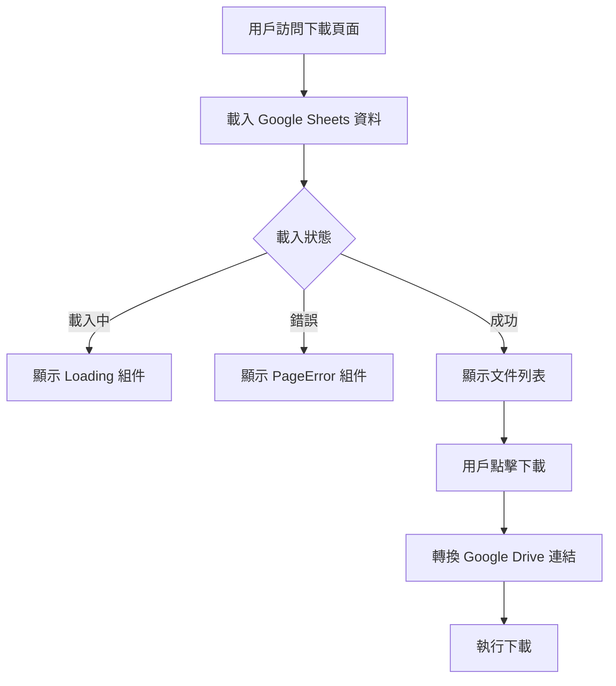

# Download 下載模組

## 📋 功能概述
下載模組從 Google Sheets 載入文件資訊並提供下載功能，支援 Google Drive 連結的直接下載轉換。

## 🎯 主要功能
- **文件列表展示**：從 Google Sheets 載入並顯示可下載文件
- **Google Drive 連結轉換**：將 Google Drive 分享連結轉換為直接下載連結
- **下載狀態管理**：顯示下載進度狀態
- **載入狀態處理**：顯示載入動畫和錯誤處理

## 🏗️ 架構設計

### 組件結構
```
Download/
├── index.jsx          # 主要下載頁面組件
├── DMDownload.jsx     # DM下載專頁組件
└── README.md         # 本文件
```

### 技術實現
- **React**：基礎框架
- **Ant Design**：UI 組件庫 (Row, Col)
- **useGoogleSheet Hook**：Google Sheets 資料載入
- **Loading/PageError 組件**：狀態處理

## 🔧 核心實現

### 主要組件
```javascript
function Download() {
  const { data, loading, error } = useGoogleSheet({
    range: "3-2申請單據下載",
    sheetId,
  });

  const [s_isDownloading, set_s_IsDownloading] = useState(false);

  if (loading) return <Loading />;
  if (error !== null) return <PageError />;

  return (
    <div className="w-full flex flex-col items-center justify-center pt-[52px]">
      <PageTitle title="申請單據下載" />
      {/* 文件列表渲染 */}
    </div>
  );
}
```

### Google Drive 連結轉換
```javascript
const convertToDirectDownloadLink = (driveLink) => {
  if (driveLink.includes("drive.google.com/file/d/")) {
    const fileId = driveLink.match(/\/d\/([^\/]+)/);
    if (fileId && fileId[1]) {
      return `https://drive.google.com/uc?export=download&id=${fileId[1]}`;
    }
  }
  return driveLink;
};
```

### 下載處理函數
```javascript
const handleDownload = async (fileName, fileUrl) => {
  try {
    set_s_IsDownloading(true);
    const directDownloadLink = convertToDirectDownloadLink(fileUrl);

    const link = document.createElement("a");
    link.href = directDownloadLink;
    link.target = "_blank";
    link.download = fileName;

    document.body.appendChild(link);
    link.click();
    document.body.removeChild(link);
  } catch (error) {
    console.error("下載失敗:", error);
  } finally {
    set_s_IsDownloading(false);
  }
};
```

### 資料來源
- **Google Sheets 範圍**：`"3-2申請單據下載"`
- **環境變數**：`VITE_PowerStation_GogleSheet__ID`

## 📊 資料流程



## 🔗 相關組件
- **PageTitle**：頁面標題組件
- **Loading**：載入狀態組件
- **PageError**：錯誤處理組件
- **FooterBgcImg**：頁尾背景圖片組件

## 🔧 環境變數
- `VITE_PowerStation_GogleSheet__ID` - Google Sheets 資料表 ID
