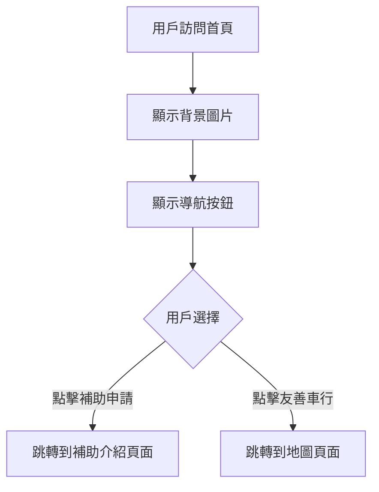

# Home 首頁模組

## 📋 功能概述
首頁是基隆市電動機車補助專案網站的入口頁面，提供用戶快速導航到主要功能區域。

## 🎯 主要功能
- **視覺化入口**：使用背景圖片和互動式按鈕
- **快速導航**：提供兩個主要入口點
  - 補助申請專區 (`/subsidy-intro`)
  - 友善車行地圖 (`/map`)

## 🏗️ 架構設計

### 組件結構
```
Home/
├── index.jsx          # 主要首頁組件
└── README.md         # 本文件
```

### 技術實現
- **React Router**：使用 `Link` 組件進行路由導航
- **Tailwind CSS**：樣式設計
- **圖片資源**：背景圖片和入口按鈕圖片

## 🔧 核心實現

### 主要組件
```javascript
function Home() {
  return (
    <div className="relative min-h-screen text-[0px]">
      
      <div className="relative flex-1 flex justify-center items-center">
        <div className="flex gap-8 flex-wrap justify-center items-center">
          <Link to="/subsidy-intro">
            
          </Link>
          <Link to="/map">
            
          </Link>
        </div>
      </div>
    </div>
  );
}
```

### 使用的資源
- `backgroundImg`：全屏背景圖片 (`@/assets/img/bg.png`)
- `applyEnterImg`：補助申請入口按鈕 (`@/assets/img/apply-enter.png`)
- `mapEnterImg`：地圖查詢入口按鈕 (`@/assets/img/map-enter.png`)

## 📊 流程圖



## 🔗 相關頁面
- `/subsidy-intro` - 補助申請介紹頁面
- `/map` - 友善車行地圖頁面
