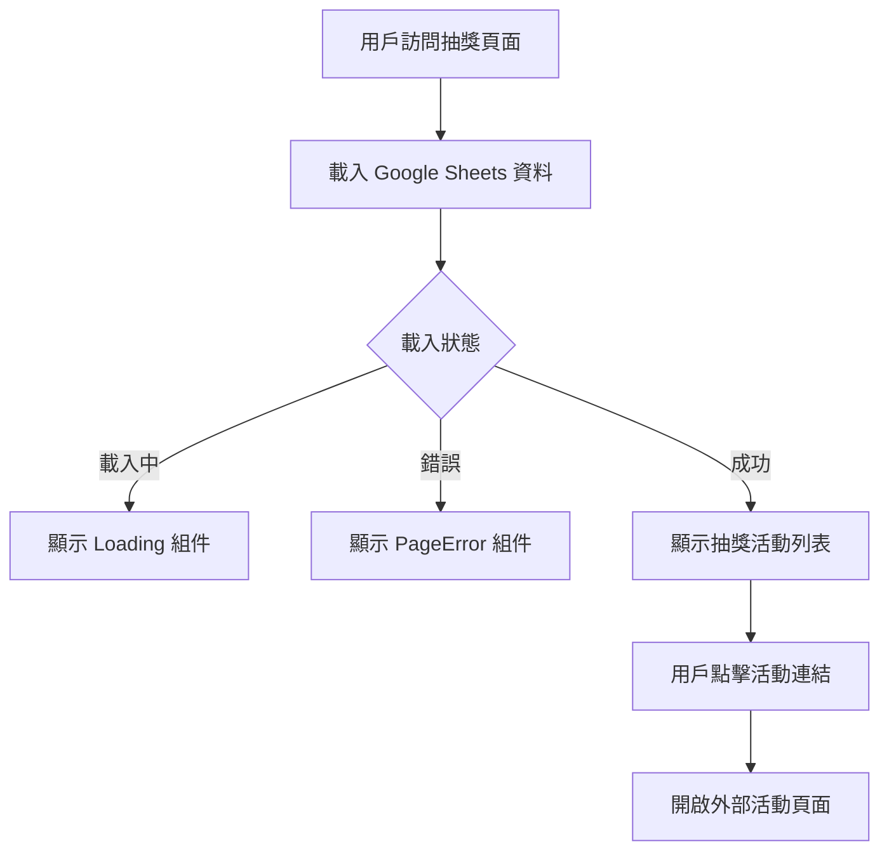

# Lottery 抽獎活動模組

## 📋 功能概述
抽獎活動模組從 Google Sheets 載入抽獎活動資訊並顯示活動列表，提供外部連結導向活動詳細頁面。

## 🎯 主要功能
- **活動資訊展示**：從 Google Sheets 載入並顯示抽獎活動列表
- **外部連結**：提供抽獎活動的外部連結
- **載入狀態**：顯示載入動畫和錯誤處理

## 🏗️ 架構設計

### 組件結構
```
Lottery/
├── index.jsx          # 主要抽獎活動組件
└── README.md         # 本文件
```

### 技術實現
- **React**：基礎框架
- **Ant Design**：UI 組件庫 (Row, Col)
- **useGoogleSheet Hook**：Google Sheets 資料載入
- **Loading/PageError 組件**：狀態處理

## 🔧 核心實現

### 主要組件
```javascript
function Lottery() {
  const { data, loading, error } = useGoogleSheet({
    range: "4-3抽獎活動資訊",
    sheetId,
  });

  if (loading) return <Loading />;
  if (error !== null) return <PageError />;

  return (
    <div className="w-full flex flex-col items-center justify-center pt-[52px]">
      <PageTitle
        icon={IconLottery}
        iconClassName="w-[24px] h-[24px] md:w-[40px] md:h-[40px]"
        title="抽獎活動總覽"
      />
      {/* 抽獎活動列表渲染 */}
    </div>
  );
}
```

### 資料來源
- **Google Sheets 範圍**：`"4-3抽獎活動資訊"`
- **環境變數**：`VITE_PowerStation_GogleSheet__ID`

### 抽獎活動列表渲染
```javascript
{Array.isArray(data?.values) && data.values.length > 1 && (
  <ul className="divide-y divide-gray-200">
    {data.values.slice(1).map((row) => (
      <li key={row[0]} className="flex items-center mt-4 md:mt-8">
        <a
          href={row[2]}
          rel="blank"
          target="_blank"
          className="w-full"
        >
          {/* 抽獎活動資訊顯示 */}
        </a>
      </li>
    ))}
  </ul>
)}
```

## 📊 資料流程



## 🔗 相關組件
- **PageTitle**：頁面標題組件
- **Loading**：載入狀態組件
- **PageError**：錯誤處理組件
- **FooterBgcImg**：頁尾背景圖片組件

## 🔧 環境變數
- `VITE_PowerStation_GogleSheet__ID` - Google Sheets 資料表 ID
