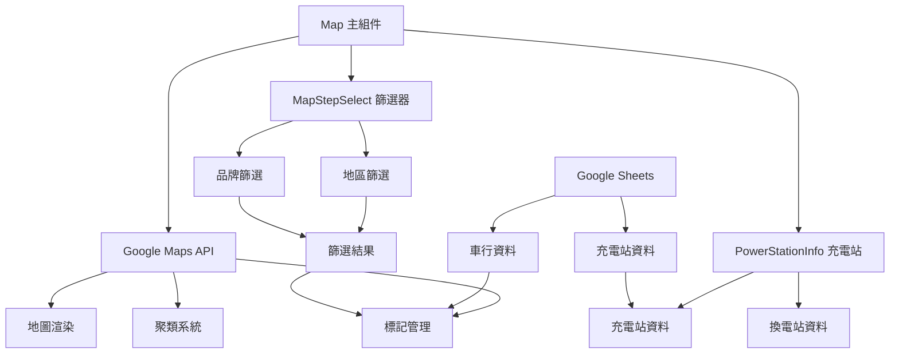
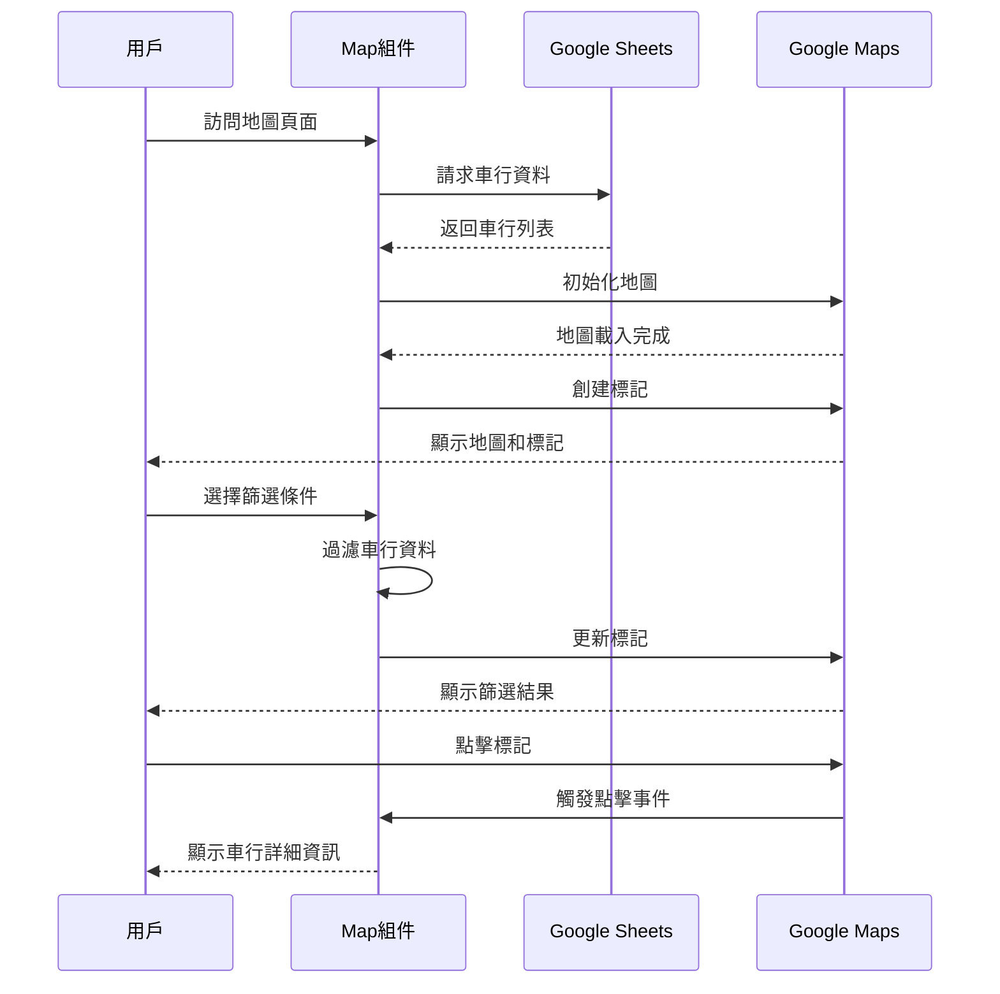

# Map 地圖模組

## 📋 功能概述
地圖模組提供基隆市友善車行的互動式地圖查詢功能，整合 Google Maps API 顯示車行位置、充電站資訊等。

## 🎯 主要功能
- **互動式地圖**：基於 Google Maps 的高品質地圖顯示
- **車行標記**：顯示友善車行的精確位置
- **標記聚類**：自動聚合鄰近的標記以提升性能
- **篩選功能**：按地區和品牌篩選車行
- **詳細資訊**：點擊標記顯示車行詳細資訊
- **充電站資訊**：整合充電站和換電站位置資料

## 🏗️ 架構設計

### 組件結構
```
Map/
├── index.jsx              # 主要地圖組件
├── MapStepSelect.jsx      # 地圖篩選控制組件
├── PowerStationInfo.jsx   # 充電站資訊組件
└── README.md             # 本文件
```

### 技術棧
- **Google Maps API**：地圖核心功能
- **@vis.gl/react-google-maps**：React Google Maps 整合
- **@googlemaps/markerclusterer**：標記聚類功能
- **Zustand**：狀態管理
- **Google Sheets API**：動態資料來源

## 🔧 核心實現

### 主要功能模組
1. **地圖渲染**
   - 使用 `APIProvider` 和 `Map` 組件
   - 自定義地圖樣式和控制項
   - 響應式地圖容器

2. **標記管理**
   - 動態創建 `AdvancedMarkerElement`
   - 自定義標記圖示和樣式
   - 點擊事件處理

3. **聚類系統**
   - `MarkerClusterer` 自動聚合標記
   - 自定義聚類渲染器
   - 動態聚類大小調整

4. **篩選系統**
   - 地區篩選（基隆市各區）
   - 品牌篩選（摩托車品牌）
   - 即時篩選結果更新

### 狀態管理
```javascript
// 使用 Zustand 管理篩選狀態
const useStore = create((set) => ({
  selectedDistricts: [],
  selectedBrands: [],
  setSelectedDistricts: (districts) => set({ selectedDistricts: districts }),
  setSelectedBrands: (brands) => set({ selectedBrands: brands })
}))
```

## 📊 系統架構圖



## 🔄 資料流程



## 🎨 UI/UX 特色
- **直觀操作**：點擊標記即可查看詳細資訊
- **性能優化**：標記聚類減少視覺混亂
- **響應式設計**：適應不同螢幕尺寸
- **載入狀態**：提供載入動畫和錯誤處理
- **自定義樣式**：隱藏不必要的 POI 標記

## 🔗 相關組件
- `MapStepSelect` - 篩選控制器
- `PowerStationInfo` - 充電站資訊頁面
- `Loading` - 載入狀態組件
- `PageError` - 錯誤處理組件

## 📱 響應式支援
- **桌面版**：完整的地圖功能和篩選選項
- **平板版**：優化的觸控操作
- **手機版**：簡化的介面和手勢支援

## 🔧 環境變數
- `VITE_GOOGLE_API_KEY` - Google Maps API 金鑰
- `VITE_MotorcycleShops_GogleSheet__ID` - 車行資料表 ID
- `VITE_PowerStation_GogleSheet__ID` - 充電站資料表 ID
