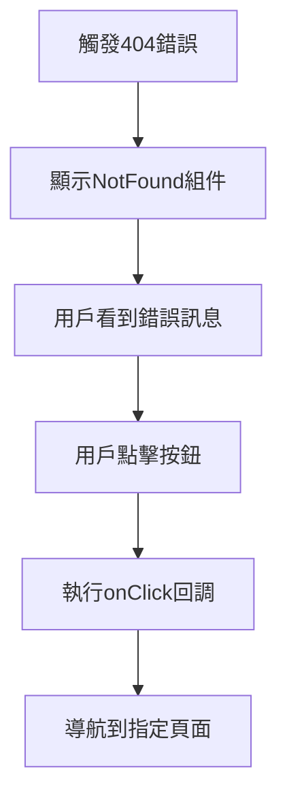

# NotFound 404錯誤頁面模組

## 📋 功能概述
NotFound 模組提供可自定義的 404 錯誤頁面，支援自定義標題、訊息和按鈕文字，並提供點擊回調功能。

## 🎯 主要功能
- **自定義錯誤訊息**：可自定義標題和內容
- **自定義按鈕**：可自定義按鈕文字和點擊行為
- **預設值支援**：提供合理的預設值
- **圖示展示**：使用 Ant Design 的 Result 組件

## 🏗️ 架構設計

### 組件結構
```
NotFound/
├── index.jsx          # 主要404錯誤頁面組件
└── README.md         # 本文件
```

### 技術實現
- **React**：基礎框架
- **Ant Design**：UI 組件庫 (Result, Button)

## 🔧 核心實現

### 主要組件
```javascript
const NotFound = ({
  onClick,
  buttonText = "返回首頁",
  title = "找不到頁面",
  message = "抱歉，您訪問的頁面不存在"
}) => {
  return (
    <Result
      status="404"
      title={title}
      subTitle={message}
      extra={
        <Button type="primary" onClick={onClick}>
          {buttonText}
        </Button>
      }
    />
  );
};
```

### Props 說明
- **onClick** - 按鈕點擊回調函數
- **buttonText** - 按鈕文字 (預設: "返回首頁")
- **title** - 錯誤標題 (預設: "找不到頁面")
- **message** - 錯誤訊息 (預設: "抱歉，您訪問的頁面不存在")

### 使用範例
```javascript
// 基本使用 (使用預設值)
<NotFound onClick={() => navigate('/')} />

// 自定義內容
<NotFound
  onClick={() => navigate('/subsidy-intro')}
  buttonText="回到申請頁面"
  title="查無申請資料"
  message="找不到您的申請記錄，請重新申請"
/>

// 用於查詢結果為空的情況
<NotFound
  onClick={() => window.location.reload()}
  buttonText="重新查詢"
  title="查無資料"
  message="沒有找到符合條件的資料"
/>
```

## 📊 使用流程



## 🔗 相關組件
- **Ant Design Result**：錯誤頁面展示組件
- **Ant Design Button**：操作按鈕組件
