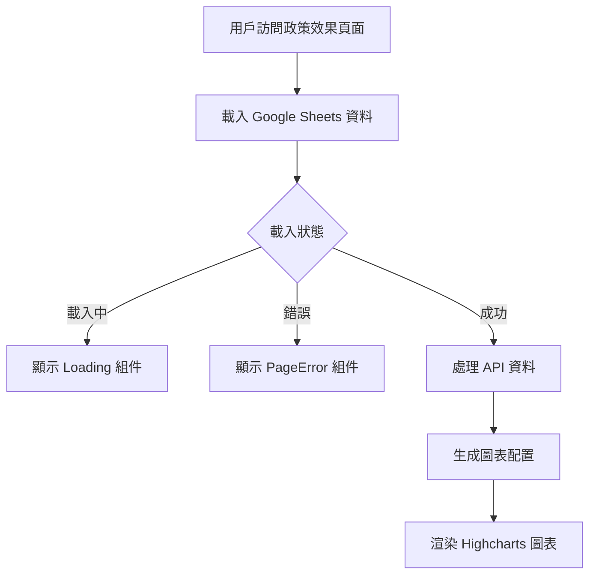

# PolicyEffect 政策效果模組

## 📋 功能概述
政策效果模組使用 Highcharts 展示基隆市電動機車補助政策的實施數據，包含申請進度、核銷狀態、補助金額等多種圖表視覺化。

## 🎯 主要功能
- **數據視覺化**：使用 Highcharts 展示政策實施數據
- **多種圖表類型**：甜甜圈圖、儀表板圖等
- **即時數據**：從 Google Sheets 載入最新數據
- **載入狀態處理**：顯示載入動畫和錯誤處理

## 🏗️ 架構設計

### 組件結構
```
PolicyEffect/
├── index.jsx          # 主要政策效果組件
└── README.md         # 本文件
```

### 技術實現
- **React**：基礎框架
- **Highcharts**：圖表庫
- **HighchartsReact**：React 整合
- **Ant Design**：UI 組件庫 (Row, Col)
- **useGoogleSheet Hook**：Google Sheets 資料載入
- **自定義圖表組件**：DonutChart, ChartCard 等

## 🔧 核心實現

### 主要組件
```javascript
function PolicyEffect() {
  const { data, loading, error } = useGoogleSheet({
    range: "1-1政策效果總覽",
    sheetId,
  });

  if (loading) return <Loading />;
  if (error !== null) return <PageError />;

  const processedData = processApiData(data);

  return (
    <div className="w-full flex flex-col items-center justify-center pt-[52px]">
      <PageTitle title="車行轉型成效" />
      {/* 圖表展示區域 */}
    </div>
  );
}
```

### 資料處理函數
```javascript
function processApiData(apiResponse) {
  if (!apiResponse || !apiResponse.values) return null;

  const filteredValues = apiResponse.values.filter((row, index) => {
    if (index < 3) return false;
    if (row[1] === "實際%數" || row[1] === "實際申請筆數") return false;
    return true;
  });

  return {
    applicationOverview: { /* 申請進度總覽 */ },
    approvalStatus: { /* 申請核銷狀態 */ },
    // 其他數據處理...
  };
}
```

### 使用的圖表組件
- **DonutChart**：甜甜圈圖組件
- **DonutChartNone**：無色彩甜甜圈圖組件
- **ChartCard**：圖表卡片容器組件
- **HighchartsReact**：Highcharts React 整合組件

### 資料來源
- **Google Sheets 範圍**：`"1-1政策效果總覽"`
- **環境變數**：`VITE_Main_GogleSheet__ID`

## 📊 資料流程



## � 相關組件
- **PageTitle**：頁面標題組件
- **Loading**：載入狀態組件
- **PageError**：錯誤處理組件
- **DonutChart**：甜甜圈圖組件
- **ChartCard**：圖表卡片組件
- **FooterBgcImg**：頁尾背景圖片組件

## 🔧 環境變數
- `VITE_Main_GogleSheet__ID` - 主要 Google Sheets 資料表 ID
