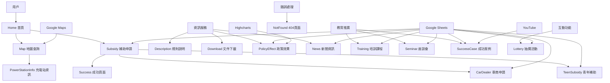
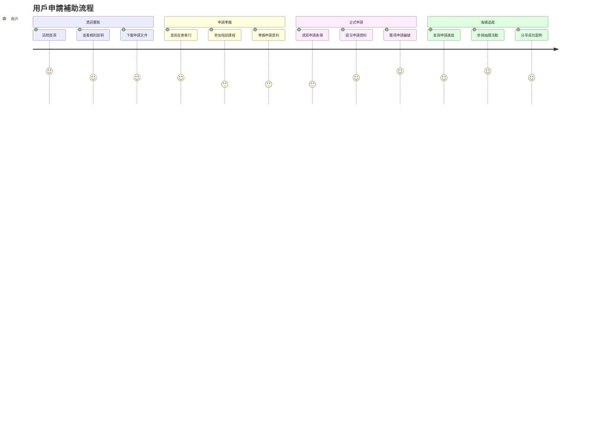

# Pages 頁面模組總覽

## 📋 專案概述
基隆市電動機車補助專案網站的頁面模組集合，提供完整的補助申請、資訊查詢、教育訓練等功能。

## 🏗️ 整體架構

### 頁面模組結構
```
src/pages/
├── Home/                    # 首頁模組
├── Map/                     # 地圖查詢模組
├── Subsidy/                 # 產業轉型補助模組
├── TeenSubsidy/            # 公益青年代辦模組
├── CarDealer/              # 車商申請模組
├── News/                   # 新聞資訊模組
├── Training/               # 培訓課程模組
├── Seminar/                # 座談會模組
├── Lottery/                # 抽獎活動模組
├── PolicyEffect/           # 政策效果模組
├── SuccessCase/            # 成功案例模組
├── Description/            # 規則說明模組
├── Download/               # 下載服務模組
├── Success/                # 成功頁面模組
├── NotFound/               # 404錯誤頁面模組
└── README.md              # 本文件
```

## 🎯 功能分類

### 核心申請流程
- **Home** - 網站入口和導航中心
- **Subsidy** - 產業轉型補助申請
- **TeenSubsidy** - 青年專屬補助申請
- **CarDealer** - 車商合作申請
- **Success** - 申請成功確認

### 資訊查詢服務
- **Map** - 友善車行地圖查詢
- **Description** - 補助規則和條件說明
- **Download** - 申請文件和表單下載
- **PolicyEffect** - 政策實施成效展示

### 教育推廣功能
- **Training** - 專業培訓課程
- **Seminar** - 產業座談會
- **SuccessCase** - 成功案例分享
- **News** - 最新消息和公告

### 互動參與機制
- **Lottery** - 抽獎活動參與
- **NotFound** - 友善的錯誤處理

## 🔧 技術架構

### 共用技術棧
- **React 18** - 現代化前端框架
- **React Router** - 單頁應用路由
- **Ant Design** - 企業級UI組件庫
- **Tailwind CSS** - 實用優先的CSS框架
- **Google Sheets API** - 動態資料管理
- **Zustand** - 輕量級狀態管理

### 專業功能整合
- **Google Maps API** - 地圖服務 (Map模組)
- **Highcharts** - 數據視覺化 (PolicyEffect模組)
- **YouTube API** - 影片播放 (SuccessCase模組)
- **檔案處理** - 多格式文件支援 (Download模組)

## 📊 系統架構圖



## 🔄 用戶流程

### 主要用戶旅程


## 🎨 設計原則

### 技術設計原則
- **模組化** - 獨立可重用的頁面組件
- **可維護性** - 清晰的代碼結構和文檔
- **性能優化** - 懶加載和代碼分割
- **錯誤處理** - 完善的錯誤邊界和回復機制

## 🔗 模組間整合

### 資料流整合
- **統一狀態管理** - Zustand 全域狀態
- **API 統一管理** - 集中的資料請求邏輯
- **錯誤統一處理** - 全域錯誤邊界
- **載入狀態統一** - 一致的載入指示器

### 導航整合
- **麵包屑導航** - 清楚的頁面層次
- **相關頁面推薦** - 智能的頁面推薦
- **快速操作** - 常用功能的快速入口
- **搜尋整合** - 全站搜尋功能

## 🔧 開發指南

### 新增頁面模組
1. 在 `src/pages/` 下創建新資料夾
2. 實作 `index.jsx` 主要組件
3. 創建 `README.md` 說明文件
4. 在 `App.jsx` 中註冊路由
5. 更新導航選單配置

### 代碼規範
- 使用 ESLint 和 Prettier 格式化
- 遵循 React Hooks 最佳實踐
- 實作 PropTypes 或 TypeScript 類型檢查
- 編寫單元測試和整合測試

## 📊 性能監控

### 關鍵指標
- **首次內容繪製 (FCP)** - < 1.5秒
- **最大內容繪製 (LCP)** - < 2.5秒
- **累積版面偏移 (CLS)** - < 0.1
- **首次輸入延遲 (FID)** - < 100毫秒

### 優化策略
- 代碼分割和懶加載
- 圖片優化和 WebP 格式
- CDN 和快取策略
- 關鍵資源預載入

## 🔧 環境變數

### 共用環境變數
```env
# Google API
VITE_GOOGLE_API_KEY=your_google_maps_api_key
VITE_GOOGLE_SHEETS_API_KEY=your_sheets_api_key

# 資料表 ID
VITE_MotorcycleShops_GogleSheet__ID=your_shops_sheet_id
VITE_PowerStation_GogleSheet__ID=your_stations_sheet_id

# 分析和追蹤
VITE_GA_TRACKING_ID=your_ga_tracking_id
VITE_ERROR_TRACKING_API=your_error_tracking_api
```

## 🎯 未來發展

### 功能擴展計畫
- **多語言支援** - 英文和其他語言版本
- **PWA 功能** - 離線使用和推播通知
- **AI 客服** - 智能客服和問答系統
- **數據分析** - 更深入的用戶行為分析

### 技術升級
- **React 19** - 最新版本升級
- **TypeScript** - 全面類型安全
- **微前端** - 模組化部署架構
- **無頭CMS** - 內容管理系統整合
