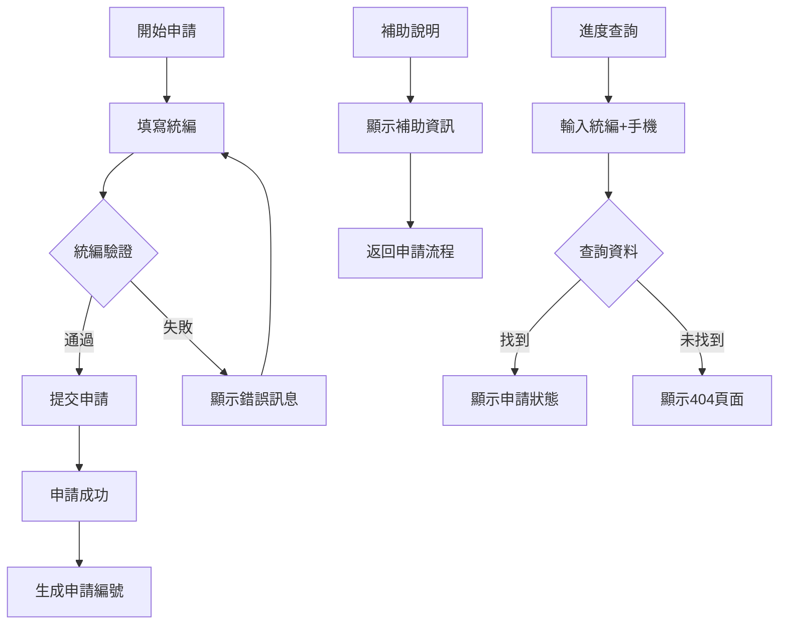
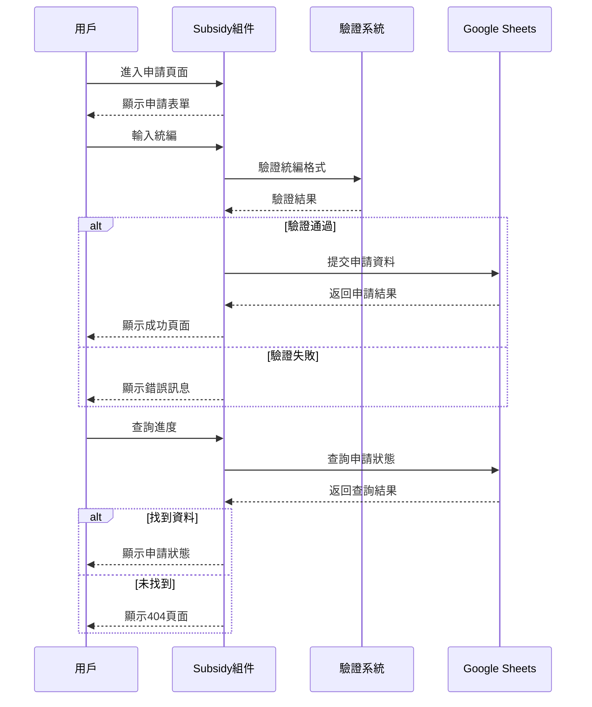

# Subsidy 產業轉型補助模組

## 📋 功能概述
產業轉型補助模組提供車行業者申請電動機車相關補助的完整流程，包含申請表單、進度查詢、補助說明等功能。

## 🎯 主要功能
- **多步驟申請流程**：引導式的補助申請程序
- **統編驗證**：自動驗證申請單位統一編號
- **進度查詢**：即時查詢申請進度和狀態
- **補助說明**：詳細的補助方案介紹
- **表單驗證**：完整的輸入驗證機制
- **資料整合**：與 Google Sheets 整合的資料管理

## 🏗️ 架構設計

### 組件結構
```
Subsidy/
├── index.jsx                 # 主要補助組件
├── Step1Form.jsx            # 第一步申請表單
├── SubsidyNavBar.jsx        # 導航控制組件
├── SubsidyResult.jsx        # 申請結果顯示
├── SubsidySupplement.jsx    # 補充資料組件
├── KeelungSubsidyInfo.jsx   # 基隆補助資訊
└── README.md               # 本文件
```

### 技術棧
- **React Hook Form**：表單狀態管理
- **Ant Design**：UI 組件庫
- **Zustand**：全域狀態管理
- **Google Sheets API**：資料存取
- **統編驗證算法**：台灣統一編號驗證

## 🔧 核心實現

### 主要功能模組

1. **申請流程管理**
   ```javascript
   const useButtonStore = create((set) => ({
     activeButton: "step1",
     setActiveButton: (button) => set({ activeButton: button })
   }))
   ```

2. **統編驗證系統**
   - 格式驗證：8位數字格式檢查
   - 邏輯驗證：台灣統編檢查碼算法
   - 特殊規則：第7位為7的特殊處理

3. **表單驗證規則**
   - 必填欄位檢查
   - 格式驗證（統編、電話、Email）
   - 即時驗證回饋

4. **資料查詢系統**
   - 使用統編和手機號碼查詢
   - Google Sheets 資料整合
   - 狀態碼處理（200成功、404未找到）

### 申請流程狀態
- `step1` - 初始申請表單
- `helper` - 補助說明頁面
- `progressSearch` - 進度查詢結果

## 📊 申請流程圖



## 🔄 資料流程



## 🎨 UI/UX 設計

### 表單設計原則
- **步驟式引導**：清晰的申請流程指示
- **即時驗證**：輸入時立即顯示驗證結果
- **錯誤處理**：友善的錯誤訊息和修正建議
- **進度指示**：明確的當前步驟和完成狀態

### 互動體驗
- **響應式布局**：適應不同螢幕尺寸
- **載入狀態**：提供載入動畫和進度指示
- **導航控制**：靈活的頁面切換機制
- **資料持久化**：表單資料暫存功能

## 🔧 統編驗證算法

```javascript
const uniformNumbers_verification = (uniformNumbers) => {
  const logicMultipliers = [1, 2, 1, 2, 1, 2, 4, 1];
  
  // 特殊規則：第7位為7時的處理
  if (uniformNumbers[6] == "7") {
    // 特殊計算邏輯
  } else {
    // 一般計算邏輯
  }
  
  return "統編驗證通過" || "錯誤訊息";
}
```

## 🔗 相關組件
- `Step1Form` - 第一步申請表單
- `SubsidyResult` - 申請結果顯示
- `KeelungSubsidyInfo` - 補助資訊說明
- `LineContact` - LINE 聯絡功能
- `Loading` - 載入狀態
- `PageError` - 錯誤處理
- `NotFound` - 404 頁面

## 📱 響應式支援
- **桌面版**：完整的表單功能和驗證
- **平板版**：優化的觸控輸入體驗
- **手機版**：簡化的介面和大按鈕設計

## 🔧 環境變數
- Google Sheets API 相關設定
- 表單提交端點設定
- 驗證服務設定
