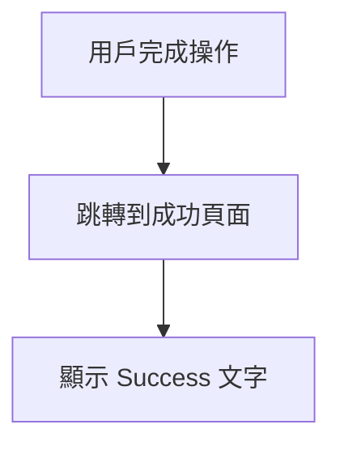

# Success 成功頁面模組

## 📋 功能概述
成功頁面模組顯示簡單的成功訊息，目前為基礎組件。

## 🎯 主要功能
- **成功確認**：顯示 "Success" 文字

## 🏗️ 架構設計

### 組件結構
```
Success/
├── index.jsx          # 主要成功頁面組件
└── README.md         # 本文件
```

### 技術實現
- **React**：基礎框架

## 🔧 核心實現

### 主要組件
```javascript
const Success = () => {
  return (
    <div>Success</div>
  )
}

export default Success
```

## 📊 流程圖



## 🔗 相關功能
- 目前為基礎組件，未與其他模組整合
