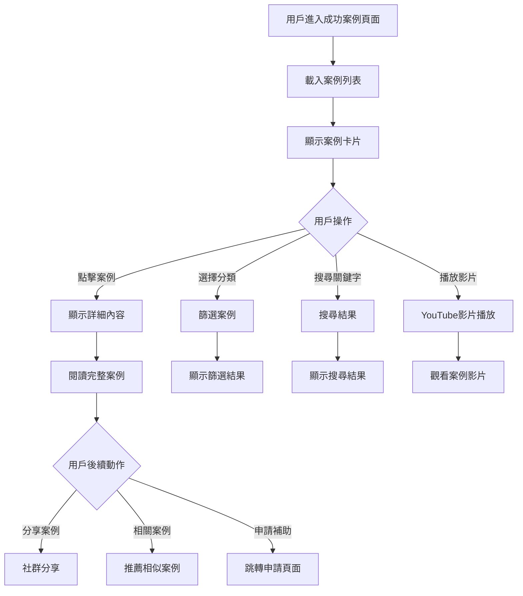
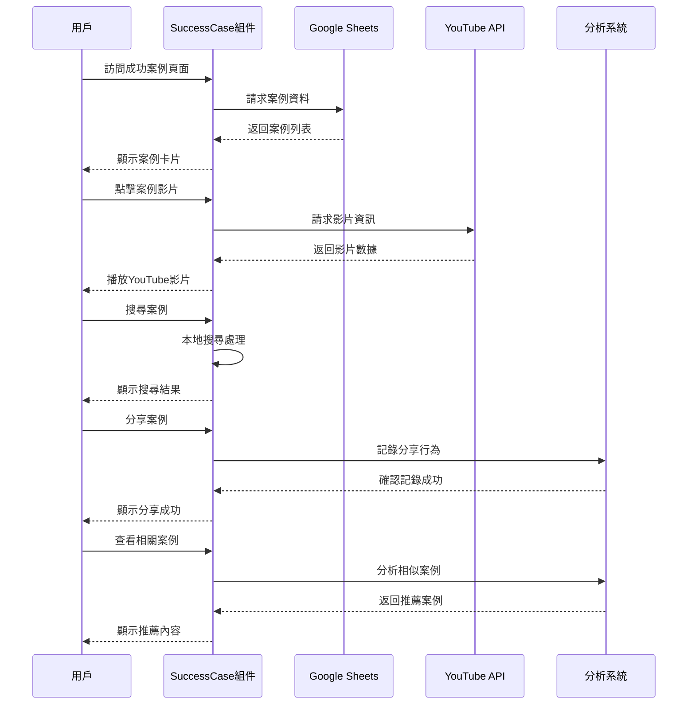

# SuccessCase 成功案例模組

## 📋 功能概述
成功案例模組展示電動機車補助政策的成功實施案例，透過影片、圖片和文字介紹，展現政策的實際效果和受益者的真實體驗。

## 🎯 主要功能
- **案例展示**：豐富的成功案例內容展示
- **影片播放**：YouTube 影片整合播放
- **分類瀏覽**：按類型和地區分類案例
- **搜尋功能**：關鍵字搜尋相關案例
- **分享功能**：社群媒體分享案例
- **互動評論**：用戶互動和回饋功能

## 🏗️ 架構設計

### 組件結構
```
SuccessCase/
├── index.jsx          # 主要成功案例組件
└── README.md         # 本文件
```

### 技術棧
- **React**：基礎框架
- **Ant Design**：UI 組件庫
- **YouTube API**：影片播放整合
- **Google Sheets API**：案例資料管理
- **響應式設計**：多裝置影片播放
- **SEO 優化**：搜尋引擎最佳化

## 🔧 核心實現

### 主要功能模組

1. **案例管理系統**
   ```javascript
   const SuccessCase = () => {
     const { data, loading, error } = useGoogleSheet({
       range: "5-2成功案例影片",
       sheetId
     });
     
     // 案例資料處理和展示邏輯
   };
   ```

2. **影片處理系統**
   ```javascript
   const extractYouTubeId = (url) => {
     const regExp = /^.*(youtu.be\/|v\/|u\/\w\/|embed\/|watch\?v=|&v=)([^#&?]*).*/;
     const match = url.match(regExp);
     return match && match[2].length === 11 ? match[2] : null;
   };
   ```

3. **分類篩選**
   - 案例類型篩選
   - 地區篩選
   - 時間篩選
   - 關鍵字搜尋

### 成功案例資料結構
```javascript
{
  caseId: "案例ID",
  title: "案例標題",
  description: "案例描述",
  category: "案例類型", // 個人、企業、車行
  location: "地區",
  participant: {
    name: "參與者姓名",
    age: 35,
    occupation: "職業",
    background: "背景介紹"
  },
  story: {
    before: "使用前狀況",
    process: "申請過程",
    after: "使用後效果",
    benefits: ["效益1", "效益2", "效益3"]
  },
  media: {
    videoUrl: "YouTube影片連結",
    images: ["圖片1.jpg", "圖片2.jpg"],
    documents: ["相關文件.pdf"]
  },
  metrics: {
    costSaving: 15000, // 節省費用
    carbonReduction: 2.5, // 碳排減量
    satisfactionScore: 9.2 // 滿意度評分
  },
  publishDate: "2024-03-15",
  featured: true, // 是否為精選案例
  tags: ["環保", "節能", "便利"]
}
```

## 📊 案例展示流程



## 🔄 資料流程



## 🎨 UI/UX 設計

### 視覺設計
- **卡片式布局**：清晰的案例卡片設計
- **影片縮圖**：吸引人的影片預覽圖
- **標籤系統**：視覺化的分類和標籤
- **成效指標**：數據化的效果展示

### 用戶體驗
- **故事敘述**：引人入勝的案例故事
- **多媒體整合**：影片、圖片、文字結合
- **互動元素**：點讚、分享、評論功能
- **個人化推薦**：基於興趣的案例推薦

## 🔧 功能特色

### 影片整合
- **YouTube 嵌入**：無縫的影片播放體驗
- **自動播放控制**：智能的播放設定
- **響應式播放器**：適應不同螢幕的播放器
- **播放統計**：觀看次數和互動統計

### 內容管理
- **動態載入**：按需載入案例內容
- **快取機制**：提升載入速度
- **SEO 優化**：搜尋引擎友善的結構
- **無障礙設計**：支援螢幕閱讀器

## 📱 響應式設計

### 桌面版
- 多欄位案例展示
- 大螢幕影片播放
- 詳細的案例資訊

### 平板版
- 兩欄式布局
- 適中的影片大小
- 觸控友善操作

### 手機版
- 單欄式列表
- 全螢幕影片播放
- 簡化的資訊顯示

## 🔗 相關功能

### 整合模組
- **Subsidy 補助**：引導用戶申請補助
- **News 新聞**：相關新聞報導
- **PolicyEffect 政策效果**：政策成效數據
- **Training 培訓**：相關教育訓練

### 外部整合
- **社群媒體**：Facebook、LINE 分享
- **YouTube**：影片平台整合
- **Google Analytics**：觀看行為分析
- **SEO 工具**：搜尋引擎最佳化

## 🔧 技術實現

### YouTube 影片處理
```javascript
const VideoPlayer = ({ videoUrl, title }) => {
  const videoId = extractYouTubeId(videoUrl);
  
  if (!videoId) {
    return <div>無效的影片連結</div>;
  }
  
  return (
    <div className="video-container">
      <iframe
        src={`https://www.youtube.com/embed/${videoId}`}
        title={title}
        className="responsive-iframe"
        allowFullScreen
      />
    </div>
  );
};
```

### 案例搜尋功能
```javascript
const searchCases = (cases, searchTerm) => {
  return cases.filter(case => 
    case.title.toLowerCase().includes(searchTerm.toLowerCase()) ||
    case.description.toLowerCase().includes(searchTerm.toLowerCase()) ||
    case.tags.some(tag => tag.toLowerCase().includes(searchTerm.toLowerCase()))
  );
};
```

## 🎯 內容策略
- **真實性**：真實的用戶體驗和故事
- **多樣性**：涵蓋不同類型和背景的案例
- **時效性**：定期更新最新的成功案例
- **啟發性**：激勵更多人參與補助計畫

## 📊 成效追蹤
- **觀看統計**：影片觀看次數和時長
- **互動分析**：點讚、分享、評論數據
- **轉換率**：觀看案例後申請補助的比例
- **用戶回饋**：案例內容的滿意度評分

## 🔧 環境變數
- `VITE_PowerStation_GogleSheet__ID` - 案例資料表 ID
- `VITE_YOUTUBE_API_KEY` - YouTube API 金鑰
- `VITE_ANALYTICS_ID` - Google Analytics 追蹤 ID
- `VITE_SOCIAL_SHARE_API` - 社群分享 API 設定
