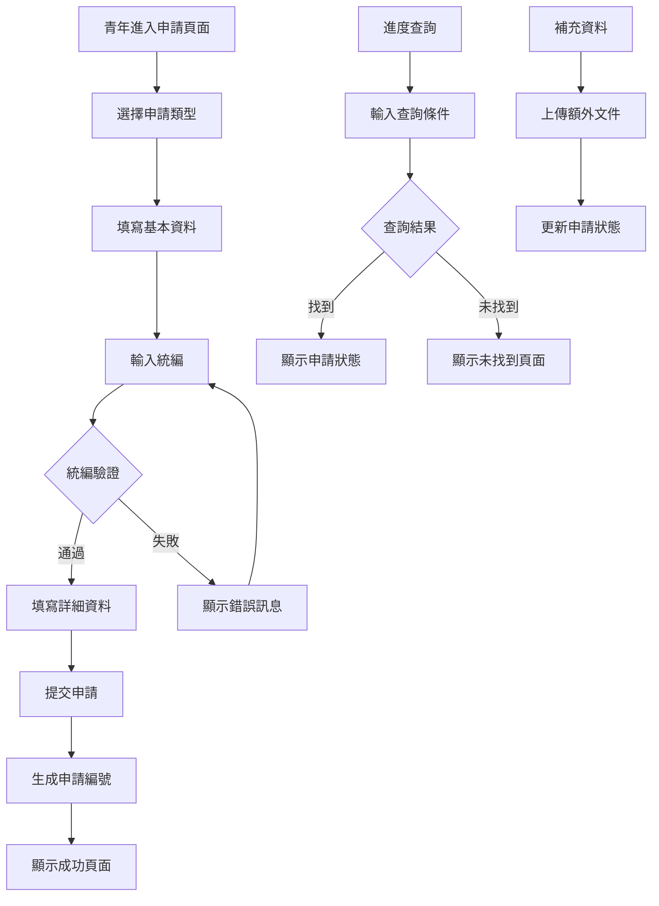
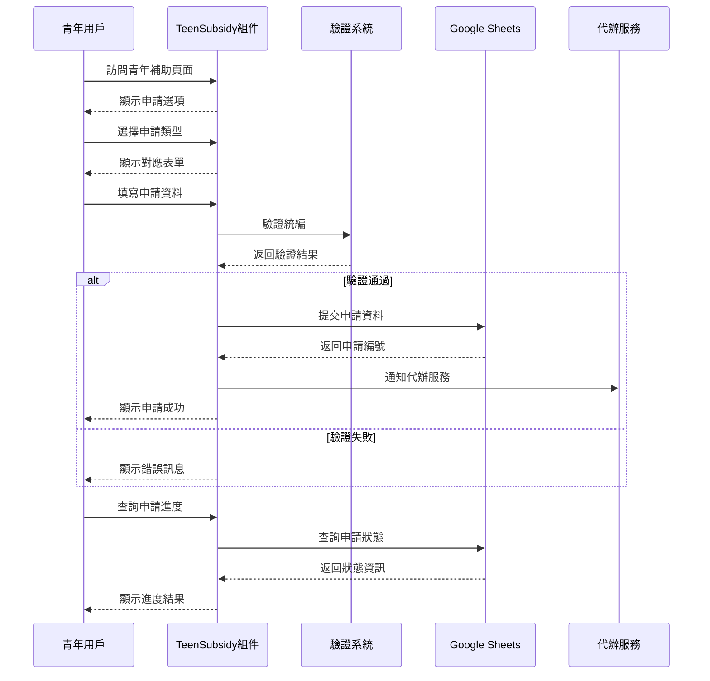

# TeenSubsidy 公益青年代辦模組

## 📋 功能概述
公益青年代辦模組專為青年族群設計的電動機車補助申請服務，提供簡化的申請流程和專屬的補助方案。

## 🎯 主要功能
- **青年專屬補助**：針對青年族群的特殊補助方案
- **代辦服務**：提供申請代辦和諮詢服務
- **統編驗證**：完整的統一編號驗證系統
- **進度查詢**：即時查詢申請狀態
- **補充資料**：支援後續資料補充功能
- **結果顯示**：清晰的申請結果呈現

## 🏗️ 架構設計

### 組件結構
```
TeenSubsidy/
├── index.jsx                    # 主要青年補助組件
├── TeenSubsidy.jsx             # 青年補助申請表單
├── TeenSubsidyResult.jsx       # 申請結果顯示
├── TeenSubsidySupplement.jsx   # 補充資料組件
└── README.md                   # 本文件
```

### 技術棧
- **React Hook Form**：表單管理
- **Ant Design**：UI 組件
- **Google Sheets API**：資料整合
- **統編驗證算法**：台灣統編驗證
- **響應式設計**：多裝置支援

## 🔧 核心實現

### 主要功能模組

1. **統編驗證系統**
   ```javascript
   const uniformNumbers_verification = (uniformNumbers) => {
     const logicMultipliers = [1, 2, 1, 2, 1, 2, 4, 1];
     // 特殊規則處理
     if (uniformNumbers[6] == "7") {
       // 第7位為7的特殊計算
     }
     // 一般驗證邏輯
   }
   ```

2. **查詢系統**
   - 使用統編和手機號碼作為查詢條件
   - 整合 `useGoogleSheetFind` Hook
   - 支援狀態碼處理（200/404）

3. **表單狀態管理**
   - 使用 Ant Design Form
   - 即時驗證和錯誤處理
   - 資料持久化支援

### 驗證規則
- **統編格式**：8位數字格式檢查
- **邏輯驗證**：台灣統編檢查碼算法
- **必填欄位**：確保關鍵資訊完整性
- **格式驗證**：電話、Email 等格式檢查

## 📊 申請流程圖



## 🔄 資料流程



## 🎨 UI/UX 設計

### 青年友善設計
- **簡潔介面**：減少複雜的操作步驟
- **視覺引導**：清晰的流程指示和進度條
- **即時回饋**：輸入驗證和狀態提示
- **行動優先**：針對手機使用優化

### 互動體驗
- **一鍵申請**：簡化的申請流程
- **智能填寫**：自動填充和建議功能
- **錯誤恢復**：友善的錯誤處理機制
- **進度追蹤**：清楚的申請狀態顯示

## 🔧 特殊功能

### 統編驗證算法詳解
```javascript
// 特殊規則：第7位為7時
if (uniformNumbers[6] == "7") {
  // 計算除第7位外的乘積和
  for (let i = 0; i < uniformNumbers.length; i++) {
    if (i != 6) {
      logicProductArr.push(
        (Number(uniformNumbers[i]) * logicMultipliers[i]) % 10
      );
    }
  }
  // 檢查和能否被5整除
}
```

### 查詢條件設定
- **主要條件**：統編 + 手機號碼
- **備用條件**：可擴展其他識別方式
- **安全性**：資料加密和隱私保護

## 🔗 相關組件
- `TeenSubsidyResult` - 申請結果顯示
- `TeenSubsidySupplement` - 補充資料功能
- `useGoogleSheetFind` - 資料查詢 Hook
- `Loading` - 載入狀態組件
- `PageError` - 錯誤處理組件
- `NotFound` - 404 頁面組件

## 📱 響應式支援
- **手機版**：針對青年用戶的手機使用習慣優化
- **平板版**：適中的螢幕尺寸和觸控體驗
- **桌面版**：完整功能和詳細資訊顯示

## 🎯 目標用戶
- **年齡範圍**：18-35歲青年族群
- **使用場景**：首次購買電動機車
- **需求特點**：簡單快速的申請流程
- **技術水平**：一般網路使用者

## 🔧 環境變數
- Google Sheets API 設定
- 青年補助專用資料表 ID
- 代辦服務聯絡資訊
